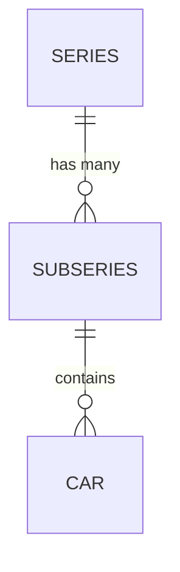

# DieCastTracker - Hot Wheels Collection Management System (Relational)

A modern, relational collection management system for Hot Wheels collectors, featuring dual-storage (Excel + PostgreSQL), professional categorization, and a sleek web interface.

## Table of Contents

- [Features](#features)
- [Relational Architecture](#relational-architecture)
- [Project Structure](#project-structure)
- [Installation](#installation)
- [Deployment (Render)](#deployment)
- [Web Interface](#web-interface)
- [Data Management](#data-management)
- [Statistics & Analytics](#statistics--analytics)

## Features

### Core Functionality
- **Dual Storage**: Saves data to both Local Excel and PostgreSQL Database simultaniously.
- **Relational Models**: Professional schema (Series ➔ Subseries ➔ Models).
- **Add/Update/Delete**: Full CRUD operations with automatic backup protection.
- **Search & Filter**: Find models by name, category, or series using database joins.
- **Statistics Dashboard**: Real-time analytics of your collection.
- **Preorders Tracking**: Complete management of orders with ETA and payment tracking.
- **Automatic Backups**: Keeps your Excel data safe with up to 5 rolling backups.

### User Experience
- **Modern Web Interface**: Responsive design with a dynamic sidebar.
- **Render Ready**: One-click deployment using the included blueprint.
- **Environment Driven**: Manage secrets and URLs using `.env` files.

## Relational Architecture

The system uses a 3-tier hierarchy to keep your collection organized:

1. **Series**: Main categories (e.g., Mainlines, Premiums).
2. **Subseries**: Specific lines within a series (e.g., Boulevard, ZAMAC).
3. **Car (Model)**: Individual cars linked to their specific subseries.



## Project Structure

```
DieCastTracker/
├── pages/                  # Web interface pages & logic
├── static/                 # CSS and JS assets
├── utils/                  # Database models and backup utilities
├── data/                   # Local Excel storage and backups
├── scripts/                # Data sync and migration scripts
├── app.py                  # Main FastAPI Application
├── render.yaml             # Deployment blueprint
├── .env                    # Environment configuration
└── README.md               # This file
```

## Installation

1. **Clone the repository**
2. **Install dependencies**:
   ```bash
   pip install -r requirements.txt
   ```
3. **Configure `.env`**:
   Copy `.env.example` to `.env` and set your `DATABASE_URL`.

## Deployment (Render)

1. **Push** your changes to GitHub.
2. Go to **Render Dashboard** -> **New +** -> **Blueprint**.
3. Select this repository.
4. Render will automatically set up the Postgres SQL database and start the web service.

## Web Interface

Start the local server:
```bash
python app.py
```
Visit `http://localhost:8000`

### Available Pages
- **Home**: Collection listing with search and edit/delete.
- **Add Model**: Unified dropdown selection for relational categories.
- **Analytics**: Deep insights into your collection patterns.
- **Preorders**: Order tracking with payment status indicators.
- **Series Management**: Manage the category hierarchy.

## Data Management

### Automatic Backup System
The system automatically creates backups before any modification to the Excel files:
- **Location**: `data/backups/`
- **Retention**: Maximum 5 backups per file.

### Data Sync
When deploying for the first time, use the sync script to move your local Excel data to the cloud:
```bash
python scripts/sync_to_postgres.py
```

---

## Happy Collecting!

DieCastTracker helps you organize your Hot Wheels collection with professional-grade tools. From relational tracking to cloud deployment, it's built for collectors who want their data safe and accessible everywhere.

*Made for Hot Wheels collectors worldwide*
